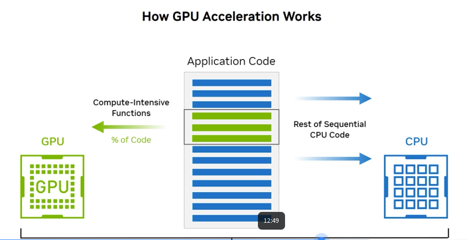

# 2. Accelerating AI with GPU
A graphics processing unit, or GPU, is a specialized electronic circuit ​designed to rapidly manipulate and alter memory to accelerate the creation of ​images in a frame buffer intended for output to a display device.

## 2.1 GPU History
**Evolution of Computer Graphics (1970s onwards):**
- Humans primarily rely on vision to process information from computers
- Computer graphics have undergone significant evolution since the 1970s
- Images on screens are comprised of picture elements, or pixels
- A pixel is the smallest unit of a digital image that can be displayed on a digital display device

**Pixel Characteristics:**
- Position
- Color
- Brightness

**Processing Requirements:**
- Every pixel must be processed at a rate that prevents human eye from perceiving delays or inconsistencies
- As display and computer technology advanced, screens now have more pixels
- Leads to more realistic image representation (screen resolution/pixel density)

**GPU Development:**
- The 1980s saw the development of individual graphics display processors
- The 1990s saw the development of separate boards or cards that can be modularly replaced in computer systems
- The processing behind the pixels is done by the GPU
- As screen resolutions increased, the processing power necessary to represent each pixel also increased
- GPUs have evolved over time to become a fundamental building block in computer architecture

---

## 2.2 GPU Architecture

**GPU Cores:**
- At the heart of the chip are thousands of GPU cores
- A core is the component of the GPU that processes data
- Multiple cores enable parallel processing

**Onboard Cache Memory:**
- Acts as a typical cache
- Stores a copy of data for quick, reliable access
- Supports high-speed data retrieval

**High-Speed GPU Memory:**
- Located closest to the cores
- Designed specifically for GPU use
- Can be shared with other GPUs
- Enables efficient data exchange and collaboration between GPUs

---

## 2.3 CPU and GPU Comparison

**Overview:**
Central processing units (CPUs) and GPUs are fundamental processing units designed for different purposes. Both CPUs and GPUs are system components that work in tandem to process code and data.

**CPU Architecture:**
- Originally, instructions were processed one at a time in the core (a component that reads and executes program instructions)

**GPU Architecture:**
- Designed to execute simple instruction sets simultaneously

### CPU vs GPU Comparison Table

| Characteristic | CPU | GPU |
|---|---|---|
| **Core Count** | Up to 128 cores | Over 10,000 compute cores |
| **Instruction Type** | Complex instruction sets | Simple instruction sets |
| **Clock Speed** | Fast clock speeds | Lower clock speeds |
| **Memory Bandwidth** | Relatively low | Very high (e.g., H100: 2 TB/s) |
| **Memory Size** | Large (hundreds of GB) | Smaller (e.g., H100: 80GB) |
| **Processing Type** | Sequential/Single-threaded optimized | Highly parallel processing |
| **Data Movement** | Large silicon dedicated to data movement | Most silicon dedicated to computation |
| **Performance per Watt** | Low (data movement overhead) | Very high (efficient computation) |
| **Latency Handling** | Low latency design with pre-fetching | Hidden latency through computation |
| **Cache Strategy** | Large caches with complex control logic | Smaller caches |
| **Register File** | Small register file | Very large register file for thread state |
| **Thread Model** | 1-2 threads per core (time-sliced) | Many overlapping concurrent threads |
| **Thread Switching** | Time penalty for context switching | Zero time penalty (every clock cycle) |
| **Data Prefetching** | Complex prefetching logic | Simple, relies on thread switching |
| **Cache Misses** | Performance degradation from cache misses | Better tolerance via thread switching |
| **Ideal Workload** | Complex branching logic, sequential tasks | Parallel computations, pixel processing |
| **Bandwidth Bound Applications** | Lower performance improvement | Significant performance improvements |

---

---

## 2.4 GPU Server Systems

**Overview:**
GPU server systems represent the backbone of high-performance computing and deep learning infrastructure, representing a specialized ecosystem for accelerated computing.

**GPU Form Factors:**
- PCIe form factor (most typical)
- SXM form factor
- MXM form factor

**NVIDIA GPU Server Solutions:**

| Solution | Description | Use Case |
|---|---|---|
| **DGX H100** | Fully integrated hardware and software solution | Purpose-built for AI center of excellence |
| **NVIDIA HGX H100** | H100 tensor core GPUs with high-speed interconnects | World's most powerful servers for largest models and datasets |
| **NVIDIA H100 PCIe** | Highest PCIe card memory bandwidth (>2000 GB/s) | Fastest time to solution for massive datasets |
| **NVIDIA MGX** | Modular reference design | Remote visualization to supercomputing at the edge |

---